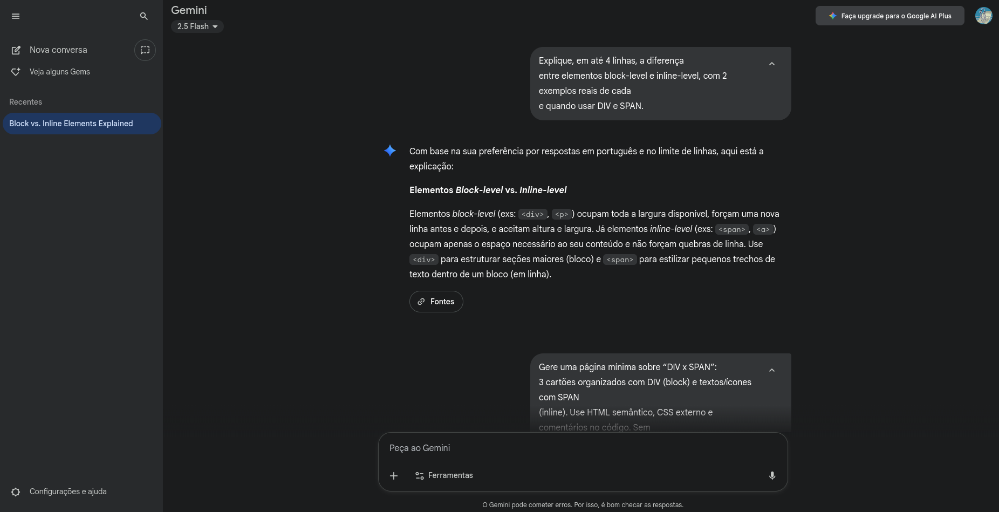
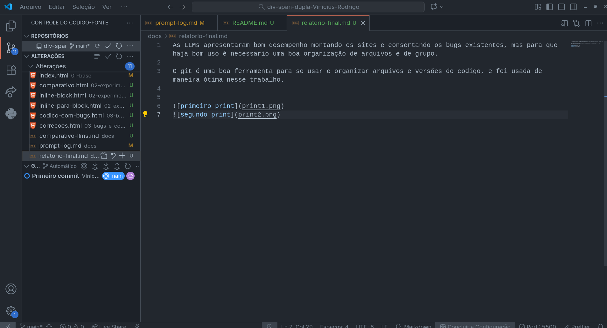

# Relatório Final - Dupla Vinícius Lopes do Nascimento & Rodrigo de Almeida Machado Barbosa

# O que aprendemos:

Aprendemos que as LLMs apresentaram bom desempenho montando os sites e consertando os bugs existentes, mas para que haja bom uso é necessário uma boa organização de arquivos e de grupo. 

O git é uma boa ferramenta para se usar e organizar arquivos e versões do codigo, e foi usada de maneira ótima nesse trabalho.

# Diferenças entre LLMs

A diferença entre as LLMs não foi tão notável como esperávamos, mas há uma diferença na maneira de escrita e demonstração de pedidos feitos pelo usuário.

Segue abaixo os prints do projeto.

Sincronia entre o git, github e o projeto.
